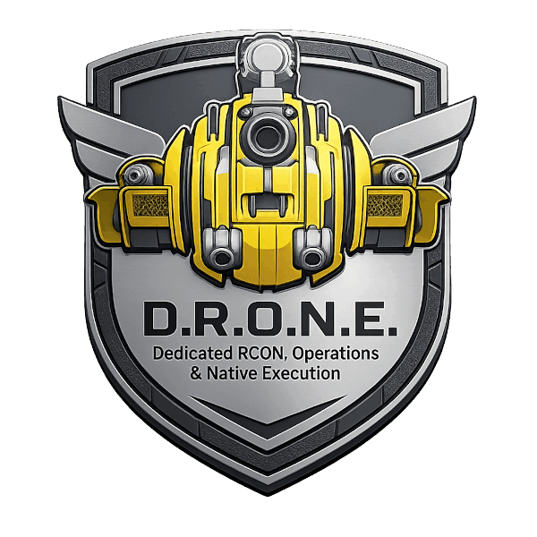

  

<h1 align="center">D.R.O.N.E.</h1>

  <b>D</b>edicated <b>R</b>CON, <b>O</b>perations &amp; <b>N</b>ative <b>E</b>xecution 
  Mehr als RCON: ein Werkzeugkasten, der im SCUM-Server selbst sitzt.

  
  
  
  

> **English:** D.R.O.N.E. started as a Source RCON server for SCUM dedicated
> servers and grew into a toolbox that lives inside the server process as a
> native UE4SS mod. Think of an admin who never sleeps, never logs out and has
> connections nobody else has: all 233 in-game admin commands over standard
> Source RCON, game rules the server settings don't offer, values beyond the
> game's own limits, and logs SCUM doesn't write. It works on a completely
> empty server, no online admin required. Free to use, closed source.
> This repository is the public feature overview. The download itself is
> currently limited to testers, see [Woher bekommen](#woher-bekommen).
> The documentation is in German.

---

## Was das hier ist

Dieses Repo zeigt, **was die Mod kann**. Es ist die öffentliche Übersicht.

Die Mod selbst, die Installationsanleitung und die vollständige Bedienungs-
anleitung liegen in einem privaten Repo, das nur Tester sehen. Warum, steht
unter [Woher bekommen](#woher-bekommen).

Die vollständige Funktionsliste, nach Themen sortiert: **[FUNKTIONEN.md](FUNKTIONEN.md)**.

## Was es ist

Stell dir einen Admin vor, der nie schläft, nie ausloggt und Türen kennt, die
sonst keiner findet. Er holt dein Auto vom anderen Kartenende, lässt Zombies
nachts schneller rennen, sagt dir, wer zuletzt am Bunker-Terminal war, und
erlaubt deinen Squad-Mitgliedern wieder das Abreißen.

Das ist D.R.O.N.E. Die Mod sitzt im Serverprozess selbst und reicht dorthin,
wo keine Serveroption hinkommt: Regeln zur Laufzeit, Werte über die Grenzen
des Spiels hinaus, Protokolle, die SCUM nicht schreibt.

Standard-RCON ist dabei nur die Eingangstür. Jeder gängige RCON-Client und
jeder Bot spricht das Protokoll bereits, und bestehende Bots laufen unverändert
weiter, weil die Ausgabeformate an den etablierten SCUM-RCON-Lösungen geeicht
sind. Es muss kein Admin online sein, und ein leerer Server ist kein
Hindernis: Spawns, Events und Teleports funktionieren auch nachts um vier,
wenn niemand eingeloggt ist.

> **Das ist eine Testfassung.** Sie läuft auf mehreren Servern im Alltag,
> gehört aber nicht ungetestet auf einen Server mit echten Spielern.

## Was es kann

### Befehle über die Verbindung

- **Alle 233 Admin-Befehle des Spiels** über RCON, so wie ein Admin sie im
  Spielchat tippen würde. Die Befehlsliste holt sich die Mod bei jedem Start aus
  dem laufenden Spiel, sie veraltet nicht mit dem nächsten SCUM-Update.
- **Die echte Antwort des Spiels** statt nur "abgesetzt": wie viele Leichen
  entfernt wurden, warum ein Spawn nicht ging, was eine Abfrage ergab.
- **Befehle für einen bestimmten Spieler**, auch solche, die im Spiel nur auf
  den Aufrufer selbst wirken: unsterblich, Godmode, Attribute, Skills.
- **Spielerlisten aus der Server-Datenbank**, im Format der etablierten Bots:
  wer ist online, wer war je da, Flaggen, Squads, Fahrzeuge. Im Sekundentakt
  abfragbar, ohne dass der Server darunter leidet.
- **Chat und Ansagen** an alle oder an einen einzelnen Spieler, mit Farben und
  Einblendungen.
- **Geld und Fame** setzen oder ändern, einzeln oder für alle Online-Spieler.
- **Moderation**: kicken, bannen, entbannen, stummschalten, Chatverbot auf Zeit.
- **Spawnen** von Items, Fahrzeugen, Tieren, NPCs und Events an beliebigen
  Koordinaten. Die Höhe darf fehlen, die Mod misst den Boden selbst.
- **Aufräumen im Umkreis**: Zombies, Tiere, Leichen, einzelne Item-Typen.
- **Fahrzeuge finden und versetzen**, zum Spieler holen oder an einen Ort
  setzen, auch am anderen Kartenende. Dazu die Fahrzeuge eines einzelnen
  Spielers auflisten.
- **Kisten finden** über Name oder ID, samt Teleport eines Spielers dorthin.
- **Spieler befreien**, die feststecken oder wegen einer Quest nicht mehr
  einloggen können.
- **Serverregeln zur Laufzeit ändern**, ohne Neustart. Dazu Zeit und Wetter.
- **Strahlenzonen**: alle 28 Quellen der Insel einzeln regeln - Reichweite,
  Kern, Stärke, Verlauf - oder alle zusammen mit einem Faktor. Eine Zone
  abschalten, damit die Stadt neben dem Kraftwerk wieder begehbar wird, und das
  Kraftwerksgelände trotzdem gefährlich lassen.
- **Survival-Regler**: sieben Faktoren dafür, wie hart das Überleben ist - wie
  schnell Spieler dreckig oder nass werden, wie schnell Kleidung trocknet, wie
  schnell Schuhe verschleißen, wie schnell die Füße wund werden.
- **Regen, der die Felder nicht erreicht**, ohne Neustart wieder in Gang
  bringen.
- **Handelstabelle lesen**: was welcher Händler führt.
- **Ingame-Uhrzeit und Zeit bis zum Quest-Reset** abfragen.
- **Generatoren um eine Flagge** auflisten, mit Füllstand.
- **Bunker-Terminals**: wer zuletzt dort Daten geladen hat, mit Restsperre.

### Die Stellschrauben

Der größte Bereich, und der unscheinbarste. Die `ServerSettings.ini` gibt eine
Handvoll Regler heraus. Die Mod gibt den Rest heraus: Werte, die SCUM fest
eingebaut hat und an die sonst niemand herankommt. Je Wert eine Zeile, und es
braucht dafür keine neue Version der Mod.

- **Quer durch das Spiel**: wie schnell Spieler laufen, ob Türen von selbst
  zufallen, wie weit eine Granate wirkt, wie stark der Bunker bei Alarm
  nachlegt, wie viel Wasser ein Gartenfeld fasst und wie viel ein Regen davon
  bringt, wie lange ein Autowrack liegen bleibt. Über hundert Bereiche,
  zusammen weit über tausend Einzelwerte.
- **Absolut oder als Anteil.** "Spieler laufen zehn Prozent schneller" lässt
  sich hinschreiben, ohne zu wissen, welche Zahl SCUM dafür führt.
- **So breit oder so eng, wie du willst**: alle Türen einer Bauart auf einmal,
  oder genau ein einzelnes Tor.
- **Beim Serverstart oder mitten im Betrieb**, und mit einem Befehl alles zurück
  auf Auslieferungszustand. Ein verdrehter Wert kostet keinen Neustart.
- **Du läufst nicht ins Leere.** Ein Wert, den es so nicht gibt, wird abgelehnt
  statt stillschweigend geschluckt, und eine geprüfte Liste liegt bei.

Dazu die Werte der Zombies, die sich live umstellen lassen, und die
Obergrenzen, die der Server beim Start stillschweigend kappt.

### Auch im Spielchat

- **Die Befehle der Mod** kann ein eingeloggter Admin im Chat tippen wie die
  Spielbefehle.
- **Für alle Spieler freigebbar**: die lesenden Befehle wie Uhrzeit und
  Quest-Reset, wenn der Betreiber das will.

### Was von allein läuft

Eingriffe ins Spiel sind ab Werk aus. Wer nichts einschaltet, merkt nichts.

- **Rechte je Admin.** SCUM kennt nur "Admin oder nicht". Mit der Mod bekommt
  jeder Admin genau die Befehle, die er haben soll, und Gruppen wie
  "Moderator" lassen sich einmal definieren und wiederverwenden.
- **Dev-Rechte ohne Datenbankeingriff.** Wer erweiterte Befehle nutzen darf,
  steht in einer einfachen Textdatei.
- **Generatoren, die nie leer werden.** Für Handelsposten, Com-Zone und
  Eventgelände.
- **Nachts andere Regeln**, zum Beispiel schnellere oder stärkere Zombies, mit
  sanftem Übergang bei Sonnenuntergang und -aufgang.
- **Obergrenzen des Spiels anheben**, etwa für mehr Rager, als SCUM erlaubt.
- **Fahrzeuge nach dem Neustart schneller in der Welt**: bei 700 Fahrzeugen
  rund 7 statt 23 Minuten.
- **Türen, die sich von selbst schließen**, je Türsorte wählbar.
- **Genähte Kleidung sieht wieder neu aus.** Normaler Verschleiß bleibt sichtbar.
- **Abreißen in der eigenen Squad-Base ab wählbarem Rang**, statt nur für
  Underboss und Boss.
- **Kisten-Sortierer**: räumt eine offene Kiste in die umstehenden Kisten,
  nach deren Namen. **Experimentell.**
- **Ausgesperrte Spieler beim Serverstart befreien**, bevor sie sich das
  nächste Mal verbinden.
- **Updates ohne Serverhalt.** Neue Version bei laufendem Server ablegen, die
  Mod prüft und übernimmt sie beim nächsten Neustart.

### Protokolle und Werkzeuge

- **Sessionlog** pro Serverlauf: jeder Befehl mit Zeitstempel und Antwort, auf
  Wunsch auch die Downloads an den Bunker-Terminals.
- **Inventar- und Leichen-Log**: wer welchen Behälter öffnet, mit Besitzer und
  Ort. **Experimentell.**
- **Konfigurator im Browser**, ohne Server und ohne Internet. Jede Einstellung
  ist dort erklärt.
- **Web-Panel** als Konsole im Browser: Verlauf, Vervollständigung, klickbare
  Ausgabe und eine Befehlsreferenz, die live aus dem Spiel kommt.
- **Selbsttest**, der alle Befehle gegen den eigenen Server durchprobiert.
- **Kommandozeilen-Client** zum Ausprobieren von Hand.
- **Briefing für KI-Assistenten**: eine Datei, mit der ein Assistent den Server
  sofort steuern kann.

Alles im Detail: **[FUNKTIONEN.md](FUNKTIONEN.md)**.

## Woher bekommen

Die Mod ist derzeit eine **Testfassung**. Der Download und die vollständige
Dokumentation liegen in einem privaten Repo, zu dem Tester eingeladen werden.

Wer die Mod auf seinem Server testen möchte, meldet sich beim Betreiber dieses
Repos. Ein öffentlicher Download folgt, sobald die Testphase abgeschlossen ist.

## Lizenz

Closed Source, kostenlos nutzbar. Erlaubt ist der Betrieb auf beliebig vielen
Servern, auch auf solchen, die sich über Spenden oder VIP-Ränge finanzieren.
Nicht erlaubt ist, die Software selbst zu verkaufen, zu verändern oder außerhalb
der offiziellen Releases weiterzuverbreiten. Ohne Gewährleistung.

Vollständiger Text: [LICENSE](LICENSE).

## Kein Zusammenhang mit den Rechteinhabern von SCUM

D.R.O.N.E. ist eine unabhängige, inoffizielle Modifikation. Es besteht keine
Verbindung zu den Entwicklern, dem Herausgeber oder sonstigen Rechteinhabern
von SCUM, und keine Befürwortung durch sie. Alle Marken gehören ihren
jeweiligen Inhabern.
